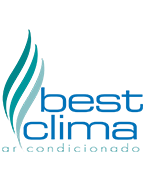

<p align="center">
  
</p>

<h1 align="center">Best Clima</h1>

<p align="center">
  <strong>Engenharia • Climatização • Tecnologia • P&D</strong>
</p>

<p align="center">
  Soluções em climatização e tecnologia para tornar operações mais eficientes,
  confiáveis e inteligentes.
</p>

<p align="center">
  <a href="#sobre-a-best-clima">Sobre</a> •
  <a href="#o-que-fazemos">Atuação</a> •
  <a href="#tecnologia--pd">Tecnologia & P&D</a> •
  <!-- <a href="#projetos">Projetos</a> • -->
  <a href="#contato">Contato</a>
</p>

---

<a id="sobre-a-best-clima"></a>
## 🏢 Sobre a Best Clima

A **Best Clima** atua em **engenharia e climatização**, unindo experiência técnica, gestão e tecnologia para entregar operações mais eficientes e confiáveis.

Buscamos transformar desafios do dia a dia em **processos melhores, informações mais úteis e soluções práticas**.

> **Climatização eficiente. Operação inteligente.**

---

<a id="o-que-fazemos"></a>
## ❄️ O que fazemos

<table>
  <tr>
    <td width="50%" valign="top">

### 🔧 Manutenção

- Manutenção preventiva e corretiva
- Inspeções e diagnósticos técnicos
- PMOC
- Acompanhamento de equipamentos

    </td>
    <td width="50%" valign="top">

### 🏗️ Engenharia

- Projetos e instalações
- Melhorias e adequações técnicas
- Gestão de equipamentos
- Planejamento e acompanhamento

    </td>
  </tr>
  <tr>
    <td width="50%" valign="top">

### 📊 Gestão

- Indicadores operacionais
- Relatórios gerenciais
- Gestão de contratos
- Organização e análise de dados

    </td>
    <td width="50%" valign="top">

### 💻 Tecnologia

- Sistemas e ferramentas digitais
- Automação de processos
- Integrações entre sistemas
- Soluções para equipes e operações

    </td>
  </tr>
</table>

---

<a id="tecnologia--pd"></a>
## 💻 Tecnologia & P&D

O departamento de **P&D (Pesquisa e Desenvolvimento)** transforma necessidades reais em **soluções de software e tecnologia**.

Além de apoiar a operação da Best Clima, a área desenvolve soluções para **necessidades externas à empresa**, pesquisando tecnologias, criando sistemas sob medida e transformando processos em produtos digitais.

### 🔬 Nossas frentes

- 🧩 Desenvolvimento de softwares sob medida
- ⚙️ Automação de processos
- 🔌 Integrações com APIs e sistemas externos
- 📊 Sistemas de gestão e análise de dados
- 💡 Pesquisa e aplicação de novas tecnologias
- 🚀 Desenvolvimento de soluções e produtos digitais

### 🧠 Do problema à solução

```text
       💡 NECESSIDADE
              │
              ▼
       🔎 PESQUISA & ANÁLISE
              │
              ▼
            🧠 P&D
              │
              ▼
       💻 DESENVOLVIMENTO
              │
              ▼
          🧪 TESTES
              │
              ▼
          🚀 SOLUÇÃO
```

### 🧰 Tecnologias

<p align="center">


<!--  -->


</p>

<!--
---

## 🚀 Projetos

Projetos desenvolvidos pelo time de Tecnologia & P&D para resolver problemas, automatizar processos e criar novas soluções.

<table>
  <tr>
    <td align="center" width="33%">


### 📊 Gestão & Dados

Soluções para automação, indicadores e análise de informações.

**[Em desenvolvimento]**

    </td>
    <td align="center" width="33%">

### 🛠️ Sistemas

Softwares desenvolvidos sob medida para diferentes necessidades.

**[Em desenvolvimento]**

    </td>
    <td align="center" width="33%">

### 🔗 Integrações

Conexão entre sistemas, APIs e fontes de dados.

**[Em desenvolvimento]**

    </td>
  </tr>
</table>
-->

<!--
Para adicionar projetos:

| Projeto | Descrição | Tecnologia |
|---|---|---|
| [Projeto X](LINK) | Breve descrição | Python • API |
| [Projeto Y](LINK) | Breve descrição | HTML • JS |
-->

---

## 📈 Nossa visão

Acreditamos que **engenharia, tecnologia e inovação** podem trabalhar juntas para tornar operações mais eficientes.

Por isso, buscamos:

- ⚡ Automatizar o que pode ser automatizado
- 📊 Transformar dados em informação útil
- 🎯 Melhorar processos e decisões
- 🛠️ Criar ferramentas que resolvam problemas reais
- 🚀 Desenvolver novas soluções por meio de P&D

---

## 🌱 Em constante evolução

Este espaço reúne os projetos e soluções tecnológicas desenvolvidos pela **Best Clima**.

Nosso objetivo é evoluir continuamente, explorando novas tecnologias e transformando ideias em soluções que gerem valor para a empresa, nossos clientes e novos desafios.

---

<a id="contato"></a>
## 📫 Contato

<p align="center">

<a href="https://www.bestclima.com.br" >
  
</a>

<a href="https://www.linkedin.com/company/best-clima/" target="_blank" rel="noopener noreferrer">
  
</a>

<a href="https://www.instagram.com/bestclimaarcondicionado/" target="_blank" rel="noopener noreferrer">
  
</a>

</p>

---

<p align="center">
  <sub>© Best Clima • Engenharia, Climatização, Tecnologia & P&D</sub>
</p>
